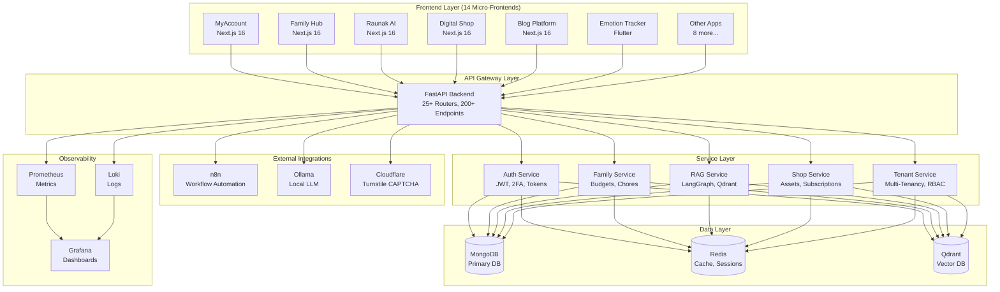
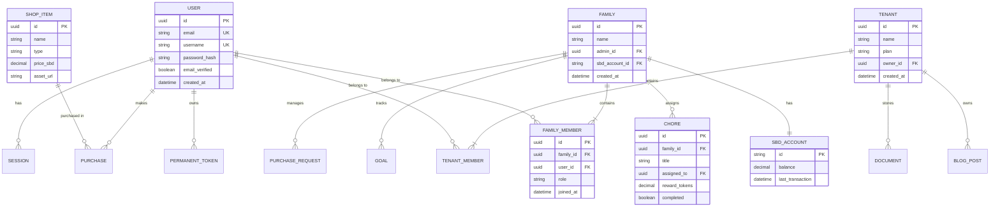

# 2. Product & Technology Docs - Second Brain Database

## 🟦 Essential Documents

### 1. MVP Demo

**Live Deployment:**
- **Docker Hub:** `docker pull rohanbatra/second_brain_database:latest`
- **GitHub:** https://github.com/rohanbatrain/second_brain_database
- **Documentation:** Available via sbd-mkdocs submodule

**Quick Start (Self-Hosted):**
```bash
# Pull and run the backend
docker run -p 8000:8000 \
  -e MONGODB_URL="mongodb://localhost:27017" \
  -e MONGODB_DATABASE="sbd_demo" \
  -e SECRET_KEY="demo-secret-key-change-in-production" \
  -e REFRESH_TOKEN_SECRET_KEY="demo-refresh-key" \
  -e FERNET_KEY="demo-fernet-key-32-bytes-base64==" \
  rohanbatra/second_brain_database:latest

# Access API documentation
open http://localhost:8000/docs
```

**Key Flows to Test:**
1. **Authentication Flow:**
   - Register user → Verify email → Login → Get JWT token
   - Enable 2FA → Generate backup codes → Verify TOTP
   - Create permanent API token → Use for automation

2. **Family Collaboration:**
   - Create family → Invite members → Accept invitation
   - Create shared budget → Request purchase → Approve/deny
   - Assign chores → Complete tasks → Earn SBD tokens

3. **AI/RAG Flow:**
   - Upload documents → Process with Docling → Store in Qdrant
   - Query with RAG → Get context-aware responses
   - Use MCP tools → Execute family/profile operations

4. **Multi-Tenancy:**
   - Create tenant → Invite members → Assign roles
   - Switch tenants → Verify data isolation
   - Admin operations → Manage quotas

---

### 2. Product Requirements Document (PRD)

**Title:** Second Brain Database - Core Platform PRD
**Status:** In Production (v1.0)
**Owner:** Rohan Batrain

#### 1. Problem Statement
Knowledge workers are locked into proprietary PKM tools (Notion, Obsidian) with:
- No data portability (vendor lock-in)
- Limited extensibility (closed APIs)
- Fragmented family collaboration tools
- No AI-native knowledge retrieval

#### 2. Goals & Success Metrics
**Primary Metrics:**
- **Adoption:** 10,000 Docker pulls in 6 months
- **Engagement:** 500 paying customers @ $50K MRR
- **Retention:** 80% monthly retention for Pro tier

**Secondary Metrics:**
- GitHub stars: 1,000+
- Community plugins: 50+ (n8n nodes, MCP tools)
- Enterprise pilots: 5 customers

#### 3. User Stories

**As a Knowledge Worker:**
- I want to self-host my PKM system so that I own my data
- I want REST API access so that I can build custom integrations
- I want AI-powered search so that I can find information quickly

**As a Family Admin:**
- I want to create a family budget so that I can manage shared expenses
- I want to assign chores with rewards so that I can incentivize kids
- I want to approve purchase requests so that I control spending

**As an Enterprise IT Admin:**
- I want multi-tenant isolation so that I can host multiple departments
- I want RBAC so that I can control access granularly
- I want audit logs so that I can track compliance

#### 4. Functional Requirements

**Authentication & Security:**
- [x] JWT-based authentication with HS256
- [x] 2FA (TOTP) with Fernet encryption
- [x] Permanent API tokens with rate limiting
- [x] Session management with Redis
- [x] Password reset with abuse prevention

**Family Management:**
- [x] Create/update/delete families
- [x] Invite members via email
- [x] Shared budgets with SBD token accounts
- [x] Chore assignment with token rewards
- [x] Purchase request approval workflow
- [x] Allowance scheduling

**AI/RAG:**
- [x] Document upload and processing (Docling)
- [x] Vector storage (Qdrant)
- [x] Hybrid search (vector + keyword)
- [x] LangGraph agent orchestration
- [x] MCP tool integration

**Multi-Tenancy:**
- [x] Tenant creation and management
- [x] RBAC (admin, member, viewer)
- [x] Quota enforcement (storage, users)
- [x] Tenant isolation at query level

**Observability:**
- [x] Prometheus metrics (/metrics endpoint)
- [x] Structured logging (Loki-compatible)
- [x] Performance tracking (sub-second latency)
- [x] Audit trails for sensitive operations

#### 5. Non-Functional Requirements
- **Performance:** API response time < 200ms (p95)
- **Scalability:** Horizontal scaling via Kubernetes
- **Availability:** 99.9% uptime (cluster mode)
- **Security:** GDPR/DPDP compliant, encryption at rest/transit
- **Mobile:** Responsive design, Flutter app for Emotion Tracker

#### 6. Out of Scope (Future Phases)
- [ ] Real-time collaborative editing (Phase 2)
- [ ] Mobile apps for all frontends (Phase 2)
- [ ] Video/audio storage (Phase 3)
- [ ] Blockchain integration for SBD tokens (Phase 3)

---

### 3. Product Roadmap (3-12 Months)

| Phase | Timeline | Focus Area | Key Features |
|-------|----------|------------|--------------|
| **Phase 1 (MVP)** | Month 1-3 | Core Platform | ✅ Auth, Family, IPAM, Shop, RAG, Multi-Tenancy |
| **Phase 2 (Growth)** | Month 4-6 | User Experience | Mobile apps (React Native), Real-time sync, Offline mode |
| **Phase 3 (Scale)** | Month 7-9 | Enterprise | SSO (SAML/OAuth), Advanced RBAC, SOC2 compliance |
| **Phase 4 (AI)** | Month 10-12 | AI Features | Voice notes, Auto-tagging, Smart summaries, Predictive insights |

**Detailed Breakdown:**

**Phase 2 (Months 4-6): User Experience**
- React Native apps for MyAccount, Family Hub, Digital Shop
- WebSocket real-time sync across devices
- Offline mode with local SQLite cache
- Progressive Web App (PWA) support
- Dark mode for all frontends

**Phase 3 (Months 7-9): Enterprise**
- SSO integration (SAML, OAuth, LDAP)
- Advanced RBAC with custom roles
- SOC2 Type II compliance
- White-label deployments
- Dedicated support portal

**Phase 4 (Months 10-12): AI Features**
- Voice note transcription (Whisper)
- Auto-tagging with LLM
- Smart summaries for long documents
- Predictive insights (spending patterns, chore completion)
- Natural language queries

---

### 4. UX/UI Wireframes

**Tools Used:** Figma (for high-fidelity), Balsamiq (for low-fi)

**Key Screens:**

**MyAccount App (sbd-nextjs-myaccount):**
- Dashboard: Security score, recent activity, quick actions
- Profile: Avatar, banner, bio, DOB, gender
- Security: 2FA setup, active sessions, login history
- Family: Family list, member management, budget overview
- Payments: SBD token balance, transaction history, send/receive

**Family Hub (sbd-nextjs-family-hub):**
- Budget Dashboard: Income, expenses, balance, charts
- Chores: Task list, assignment, completion tracking
- Goals: Shared family goals, progress bars
- Allowances: Recurring token distribution schedules

**Raunak AI (sbd-nextjs-raunak-ai):**
- Chat Interface: Message history, streaming responses
- Document Upload: Drag-and-drop, processing status
- Tools Panel: Available MCP tools, execution history
- Settings: Model selection, temperature, max tokens

---

### 5. Architecture Diagram



---

### 6. Tech Stack Justification

#### Backend: FastAPI (Python)
**Why:**
- **Performance:** Async/await for high concurrency (10K+ req/sec)
- **Developer Experience:** Auto-generated OpenAPI docs, type hints
- **Ecosystem:** Rich Python ecosystem (LangChain, Qdrant, Docling)
- **Validation:** Pydantic for request/response validation

**Alternatives Considered:**
- Node.js (Express/NestJS): Slower for CPU-intensive tasks (RAG, document processing)
- Go: Steeper learning curve, smaller AI/ML ecosystem
- Django: Too heavy, REST framework less modern than FastAPI

#### Database: MongoDB
**Why:**
- **Flexibility:** Schema-less design for evolving data models
- **Scalability:** Horizontal scaling with sharding
- **Developer Experience:** JSON-like documents, easy to work with
- **Ecosystem:** Mature drivers, Atlas for managed hosting

**Alternatives Considered:**
- PostgreSQL: Rigid schema, harder to evolve
- DynamoDB: Vendor lock-in (AWS), expensive at scale
- Cassandra: Overkill for current scale, complex operations

#### Cache: Redis
**Why:**
- **Speed:** In-memory, sub-millisecond latency
- **Features:** Pub/sub, streams, sorted sets
- **Session Management:** Built-in TTL, atomic operations
- **Ecosystem:** Mature, battle-tested

**Alternatives Considered:**
- Memcached: Limited data structures
- Hazelcast: Overkill, Java-based

#### Frontend: Next.js 16
**Why:**
- **Performance:** Turbopack, React Server Components
- **SEO:** Server-side rendering, static generation
- **Developer Experience:** File-based routing, TypeScript support
- **Ecosystem:** Huge community, Vercel deployment

**Alternatives Considered:**
- Vue/Nuxt: Smaller ecosystem
- SvelteKit: Less mature, smaller talent pool
- Remix: Newer, less proven at scale

#### Mobile: Flutter
**Why:**
- **Cross-Platform:** Single codebase for iOS/Android
- **Performance:** Compiled to native code
- **UI:** Rich widget library, Material Design
- **Developer Experience:** Hot reload, Dart language

**Alternatives Considered:**
- React Native: Slower performance, bridge overhead
- Native (Swift/Kotlin): 2x development cost

#### AI Stack: LangGraph + Qdrant + Ollama
**Why:**
- **LangGraph:** Agent orchestration, complex workflows
- **Qdrant:** Fast vector search, hybrid search support
- **Ollama:** Local LLM inference, privacy-friendly

**Alternatives Considered:**
- OpenAI API: Expensive, privacy concerns
- Pinecone: Vendor lock-in, expensive
- LlamaIndex: Less flexible than LangGraph

---

## 🟦 Optional / Advanced Documents

### 7. System Design Document

**High-Level Architecture:**

**Monolith vs Microservices:**
- **Current:** Modular monolith (FastAPI backend + 14 micro-frontends)
- **Future (Phase 3):** Microservices (Auth, Family, RAG, Shop as separate services)

**Data Flow:**
1. **User Request:** Frontend (Next.js) → API Gateway (FastAPI)
2. **Authentication:** JWT validation → Redis session check
3. **Business Logic:** Service layer → Database queries
4. **Response:** JSON serialization → Frontend rendering

**Key Components:**
- **Auth Service:** JWT generation, 2FA verification, token management
- **Family Service:** Budget calculations, chore assignments, purchase approvals
- **RAG Service:** Document processing, vector search, LLM inference
- **Shop Service:** Asset purchases, subscription management
- **Tenant Service:** Tenant isolation, RBAC enforcement

---

### 8. API Documentation

**OpenAPI Specification:** Available at `/openapi.json`

**Base URL:** `https://api.secondbraindatabase.com/v1` (production)

**Authentication:** Bearer Token (JWT)
```bash
curl -H "Authorization: Bearer YOUR_JWT_TOKEN" \
  https://api.secondbraindatabase.com/v1/profile/me
```

**Key Endpoint Groups:**

**Authentication (`/auth/*`):**
- `POST /auth/register` - Register new user
- `POST /auth/login` - Login and get JWT
- `POST /auth/2fa/enable` - Enable 2FA
- `POST /auth/2fa/verify` - Verify TOTP code
- `GET /auth/sessions` - List active sessions

**Family (`/family/*`):**
- `POST /family/create` - Create family
- `GET /family/my-families` - List user's families
- `POST /family/{id}/invite` - Invite member
- `GET /family/{id}/budget` - Get budget details
- `POST /family/{id}/chores` - Create chore

**RAG (`/rag/*`):**
- `POST /rag/documents/upload` - Upload document
- `POST /rag/query` - Query with RAG
- `GET /rag/documents` - List documents
- `DELETE /rag/documents/{id}` - Delete document

**Shop (`/shop/*`):**
- `GET /shop/items` - List available items
- `POST /shop/purchase` - Purchase item
- `GET /shop/owned` - List owned items
- `POST /subscriptions/subscribe` - Subscribe to plan

**Tenants (`/tenants/*`):**
- `POST /tenants/create` - Create tenant
- `GET /tenants/my-tenants` - List user's tenants
- `POST /tenants/{id}/invite` - Invite member
- `PUT /tenants/{id}/roles` - Update member roles

---

### 9. Infrastructure Plan (DevOps)

**Hosting:** AWS (primary), GCP (future multi-cloud)

**Architecture:**
```
┌─────────────────────────────────────────┐
│         CloudFlare (CDN + DDoS)         │
└──────────────┬──────────────────────────┘
               │
┌──────────────▼──────────────────────────┐
│      AWS ALB (Application Load Balancer)│
└──────────────┬──────────────────────────┘
               │
┌──────────────▼──────────────────────────┐
│   EKS (Kubernetes) - Auto-scaling       │
│   ┌─────────────────────────────────┐   │
│   │  FastAPI Pods (3-10 replicas)   │   │
│   └─────────────────────────────────┘   │
└──────────────┬──────────────────────────┘
               │
┌──────────────▼──────────────────────────┐
│   MongoDB Atlas (M30 cluster)           │
│   - Primary + 2 Replicas                │
│   - Auto-scaling storage                │
└─────────────────────────────────────────┘
┌─────────────────────────────────────────┐
│   ElastiCache (Redis) - 3 nodes         │
└─────────────────────────────────────────┘
```

**CI/CD Pipeline:**
1. **Code Push:** GitHub → Trigger GitHub Actions
2. **Build:** Docker image build → Push to ECR
3. **Test:** Run pytest, linting, type checking
4. **Deploy:** Kubernetes rolling update (zero downtime)
5. **Monitor:** Prometheus scrapes metrics, Loki collects logs

**Environments:**
- **Development:** Local Docker Compose
- **Staging:** EKS (t3.medium, 2 nodes)
- **Production:** EKS (t3.large, 5-10 nodes, auto-scaling)

---

### 10. Security Practices Overview

**Data Encryption:**
- **At Rest:** AES-256 (MongoDB encryption, EBS volumes)
- **In Transit:** TLS 1.3 (ALB → Pods, Pods → MongoDB)
- **Secrets:** Fernet encryption for TOTP secrets

**Access Control:**
- **RBAC:** Role-based access control within tenants
- **API Tokens:** Scoped permissions, rate limiting
- **2FA:** TOTP (Time-based One-Time Password)

**Compliance:**
- **GDPR:** Data export, right to be forgotten, consent management
- **DPDP (India):** Data localization, breach notification
- **SOC2 (Planned):** Security controls, audit trails

**Audits:**
- **Dependency Scanning:** Snyk, Dependabot
- **Vulnerability Scanning:** Trivy (container images)
- **Penetration Testing:** Planned for Series A

---

### 11. Scalability & Reliability Strategy

**Horizontal Scaling:**
- **API Servers:** Auto-scaling groups (3-10 pods)
- **Database:** MongoDB sharding (future, > 1TB data)
- **Cache:** Redis cluster (3-5 nodes)

**Caching Strategy:**
- **Edge Caching:** CloudFlare (static assets, API responses)
- **Application Caching:** Redis (sessions, user profiles, frequent queries)
- **Database Caching:** MongoDB query cache

**Disaster Recovery:**
- **RPO (Recovery Point Objective):** 1 hour (MongoDB snapshots every hour)
- **RTO (Recovery Time Objective):** 4 hours (restore from snapshot)
- **Backups:** Daily full backups, 30-day retention

**High Availability:**
- **Database:** MongoDB replica set (primary + 2 secondaries)
- **Cache:** Redis Sentinel (automatic failover)
- **API:** Multi-AZ deployment (3 availability zones)

---

### 12. Technical Debt List

*Honest assessment of shortcuts taken for MVP.*

- [ ] **Refactor monolithic auth logic into separate service** (Priority: Medium)
  - Current: All auth logic in `routes/auth/`
  - Target: Separate Auth microservice

- [ ] **Improve test coverage** (Priority: High)
  - Current: ~60% coverage
  - Target: 90% coverage (unit + integration tests)

- [ ] **Optimize image compression pipeline** (Priority: Low)
  - Current: Synchronous image processing
  - Target: Async processing with Celery

- [ ] **Implement database connection pooling** (Priority: Medium)
  - Current: 50 max connections
  - Target: Dynamic pooling based on load

- [ ] **Add request/response caching** (Priority: Medium)
  - Current: No HTTP caching headers
  - Target: ETags, Cache-Control headers

---

### 13. Codebase Readme + Setup Guide

```markdown
# Second Brain Database - Setup Guide

## Prerequisites
- Python 3.11+
- MongoDB 6.0+
- Redis 7.0+
- Docker (optional, for containerized deployment)

## Local Development Setup

### 1. Clone Repository
\`\`\`bash
git clone https://github.com/rohanbatrain/second_brain_database.git
cd second_brain_database
\`\`\`

### 2. Install Dependencies
\`\`\`bash
# Using uv (recommended)
uv sync --extra dev

# Or using pip
pip install -r requirements.txt
\`\`\`

### 3. Configure Environment
\`\`\`bash
# Copy example config
cp .env.development.example .sbd

# Edit .sbd with your settings
nano .sbd
\`\`\`

### 4. Run Database Migrations
\`\`\`bash
# MongoDB indexes are created automatically on startup
# No manual migration needed
\`\`\`

### 5. Start Development Server
\`\`\`bash
uv run uvicorn src.second_brain_database.main:app --reload
\`\`\`

### 6. Access API Documentation
- **Swagger UI:** http://localhost:8000/docs
- **ReDoc:** http://localhost:8000/redoc
- **OpenAPI JSON:** http://localhost:8000/openapi.json

## Testing
\`\`\`bash
# Run all tests
uv run pytest

# Run with coverage
uv run pytest --cov=src/second_brain_database

# Run specific test file
uv run pytest tests/test_auth.py
\`\`\`

## Linting & Formatting
\`\`\`bash
# Format code
uv run black src/
uv run isort src/

# Run linters
uv run flake8 src/
uv run pylint src/

# Type checking
uv run mypy src/
\`\`\`

## Docker Deployment
\`\`\`bash
# Build image
docker build -t sbd-backend .

# Run container
docker run -p 8000:8000 --env-file .env sbd-backend
\`\`\`
```

---

### 14. Feature Prioritization Framework

**Methodology:** RICE Score

**Formula:** `Score = (Reach × Impact × Confidence) / Effort`

**Example Prioritization:**

| Feature | Reach | Impact | Confidence | Effort | RICE Score | Priority |
|---------|-------|--------|------------|--------|------------|----------|
| Mobile Apps | 5000 | 3 | 80% | 6 | 2000 | High |
| Real-time Sync | 3000 | 3 | 70% | 4 | 1575 | High |
| SSO Integration | 500 | 3 | 90% | 3 | 450 | Medium |
| Voice Notes | 2000 | 2 | 60% | 5 | 480 | Medium |
| Blockchain Tokens | 100 | 1 | 30% | 8 | 4 | Low |

**Definitions:**
- **Reach:** Number of users impacted per quarter
- **Impact:** 1 (Low) to 3 (High)
- **Confidence:** Percentage (0-100%)
- **Effort:** Person-months

---

### 15. Data Model Diagram (ERD)


